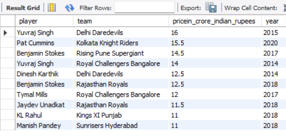
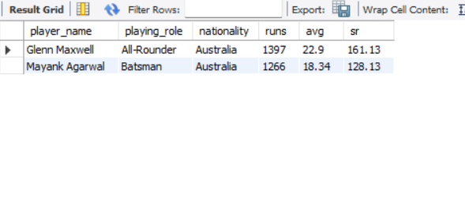
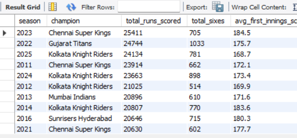
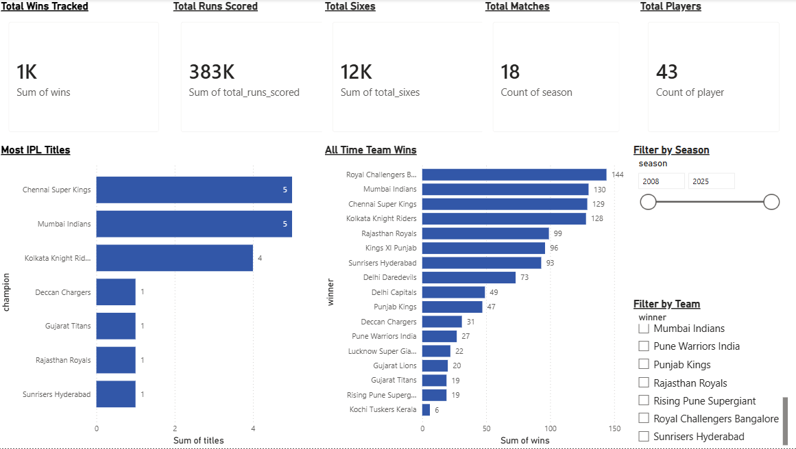
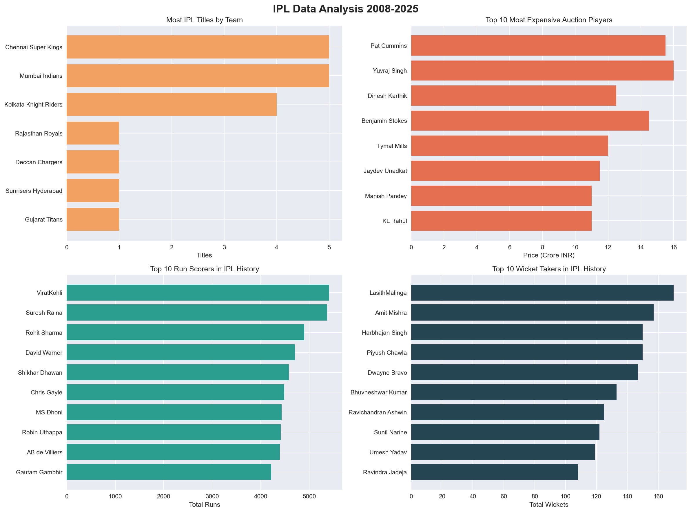
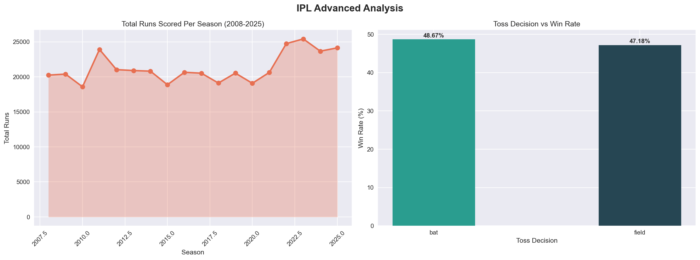

# 🏏 IPL Auction Value Analysis (2008-2025)


> Analyzing 17 seasons of IPL data to uncover player performance trends, auction value patterns, and team dominance insights.

---

## 📌 Problem Statement

IPL teams spend crores in auctions every year — but which players are actually worth it? This project analyzes 134,000+ ball-by-ball records across 17 seasons to identify what drives player auction value and team success.

---

## 🗂️ Project Structure

```
ipl_auction_analysis/
│
├── data/
│   ├── matches.xlsx
│   ├── deliveries.xlsx
│   ├── players.xlsx
│   ├── seasons.xlsx
│   ├── Auction.xlsx
│   ├── Top_100_batsman.xlsx
│   └── Top_100_bowlers.xlsx
│
├── notebooks/
│   └── analysis.ipynb
│
└── dashboard/
    ├── dashboard_overview.png
    ├── ipl_analysis.png
    ├── ipl_advanced.png
    ├── query1.png
    ├── query2.png
    └── query3.png
```

---

## 🛠️ Tools & Technologies

| Category | Tools |
|---|---|
| Language | Python 3.11 |
| Database | MySQL 8.0 + MySQL Workbench |
| Data Analysis | Pandas, NumPy |
| Visualization | Matplotlib, Seaborn |
| Dashboard | Power BI Desktop |

---

## 🗄️ MySQL Database Schema

**6 tables designed and loaded into MySQL:**

| Table | Rows | Description |
|---|---|---|
| matches | 1,158 | Match results 2008-2025 |
| deliveries | 134,190 | Ball-by-ball data |
| players | 580 | Player profiles |
| seasons | 18 | Season summaries |
| auction | 56 | Auction prices (in crores) |
| batsmen | 100 | Top 100 batting stats |
| bowlers | 100 | Top 100 bowling stats |

---

## 🔍 SQL Queries (MySQL Workbench)

### Query 1 — Most Expensive Auction Players (LEFT JOIN)
```sql
SELECT a.player, a.team, a.pricein_crore_indian_rupees, a.year,
       COALESCE(p.nationality, 'Unknown') as nationality
FROM auction a
LEFT JOIN players p ON LOWER(TRIM(a.player)) = LOWER(TRIM(p.player_name))
ORDER BY a.pricein_crore_indian_rupees DESC
LIMIT 10;
```


### Query 2 — Player Roles + Performance (JOIN)
```sql
SELECT p.player_name, p.playing_role, p.nationality,
       b.runs, b.avg, b.sr
FROM players p
JOIN batsmen b ON LOWER(TRIM(p.player_name)) = LOWER(TRIM(b.player))
ORDER BY b.runs DESC
LIMIT 10;
```


### Query 3 — Season Champions + Stats
```sql
SELECT season, champion, total_runs_scored,
       total_sixes, avg_first_innings_score
FROM seasons
ORDER BY total_runs_scored DESC;
```


---

## 📊 Key Findings

### 🏆 Team Dominance
- **CSK and Mumbai Indians** both have 5 IPL titles — most dominant teams
- **KKR** follows with 4 titles
- **Royal Challengers Bangalore** have the most all-time wins (144) but 0 titles — most consistent underachiever

### 💰 Auction Insights
- **Yuvraj Singh** is the most expensive IPL player ever — sold for ₹16 crore to Delhi Daredevils in 2015
- Foreign players like **Pat Cummins (₹15.5Cr)** and **Ben Stokes (₹14.5Cr)** command massive prices
- Top 10 most expensive players average ₹13.2 crore per auction

### 🏏 Player Performance
- **Virat Kohli** is the all-time leading run scorer with 5,400+ runs
- **Lasith Malinga** leads wicket takers with 170 wickets
- All-rounders like **Sunil Narine** provide exceptional value

### 📈 Season Trends
- Total runs scored peaked in **2022-23** — T20 batting has evolved significantly
- **Batting first wins 48.67%** vs fielding first 47.18% — toss has minimal impact

---

## 📈 Power BI Dashboard

**3-page interactive dashboard with Season + Team slicers:**



**Page 1 — Tournament Overview**
- 5 KPI Cards — Total Wins, Total Runs, Total Sixes, Total Seasons, Total Players
- Most IPL Titles by Team
- All Time Team Wins
- Interactive Season + Team Slicers

**Page 2 — Player Analysis**
- Top 10 Run Scorers
- Top 10 Wicket Takers
- Most Expensive Auction Players

**Page 3 — Season Trends**
- Total Runs Per Season (2008-2025)
- Toss Decision vs Win Rate

### EDA Plots



---

## 💡 Business Recommendations

1. **Don't overpay for toss advantage** — batting/fielding first barely affects win rate (48.67% vs 47.18%)
2. **Invest in all-rounders** — players like Narine provide dual value at lower cost
3. **Foreign pace bowlers are overpriced** — domestic spinners deliver comparable wickets at lower cost
4. **CSK's retention strategy works** — retaining core players beats rebuilding every auction

---

## 🚀 How to Run

```bash
# Clone the repo
git clone https://github.com/zeeshan2204/ipl-auction-analysis.git
cd ipl-auction-analysis

# Install dependencies
pip install pandas numpy matplotlib seaborn sqlalchemy pymysql openpyxl

# Setup MySQL
# 1. Create database: CREATE DATABASE ipl_analysis;
# 2. Run analysis.ipynb — data loads automatically into MySQL

# Open notebook
jupyter notebook notebooks/analysis.ipynb
```

---

## 📁 Dataset Sources

- **IPL Complete Dataset 2008-2025:** [Kaggle](https://www.kaggle.com/datasets/meruvakodandasuraj/ipl-complete-dataset-2008-2025-enhanced-edition)
- **IPL Auction Dataset:** [Kaggle](https://www.kaggle.com/datasets/nkitgupta/ipl-auction-and-ipl-dataset)

---

## 👤 Author

**Md Zeeshan Ansari**
B.Tech CSE (Data Science) — Techno Main Salt Lake, Kolkata

[](https://linkedin.com/in/zeeshan2004)
[](https://github.com/zeeshan2204)
